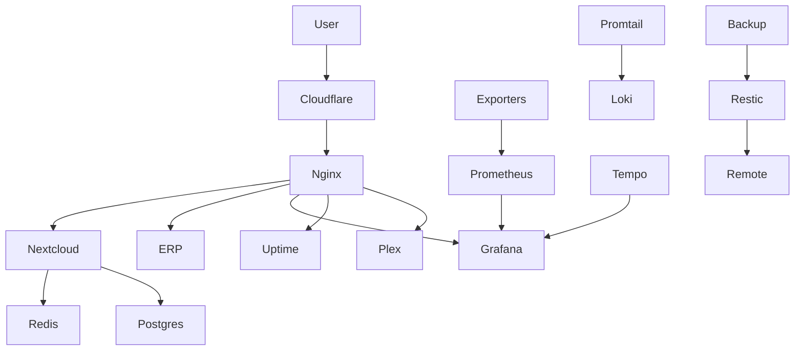

# 🧱 DevOps Homelab Infrastructure

## 📌 Overview

Production-like self-hosted infrastructure designed to simulate real-world DevOps environments.

This setup focuses on **observability, secure access, service isolation, and reliability**, running 20+ containerized services using Docker.

---

## 🏗️ Architecture

👉 Detailed diagram: [View Full Architecture](./architecture/architecture.md)

### 🔁 High-Level Flow



---

## 🧠 Architecture Decisions

### 🔐 Zero Trust Ingress

* Uses **Cloudflare Tunnel**
* No direct port exposure
* Domain-based routing for services

### 🌐 Network Segmentation

* `nextcloud_default` → app + DB + Redis
* `monitoring_default` → observability stack
* `test_default` → ERP system

👉 Ensures isolation and security between services

### ⚖️ High Availability Design

* Nextcloud runs **3 replicas**
* Load balanced via Nginx
* Stateless architecture enables scaling

---

## 🧱 Core Applications

* **Nextcloud (3-instance cluster)**
* **PostgreSQL (multiple instances)**
* **Redis (caching layer)**
* **Collabora (document editing)**
* **Custom ERP system**

---

## 📊 Observability Stack

### Metrics

* Prometheus (scraping exporters)
* Node Exporter (host metrics)
* cAdvisor (container metrics)
* Blackbox Exporter (endpoint checks)

### Visualization

* Grafana dashboards:

  * System metrics
  * Container monitoring
  * Backup observability

### Logging

* Promtail → Loki → Grafana

### Tracing

* Tempo (distributed tracing)

---

## 🔐 Networking & Access

* **Cloudflare Tunnel**

  * Zero Trust ingress
  * Domain-based routing

* **Tailscale VPN**

  * Secure private access
  * Used for backup servers and internal connectivity

---

## 💾 Backup System

Custom backup solution using **Restic + SFTP**:

* Parallel backups to:

  * Raspberry Pi (LAN)
  * Remote server (via Tailscale)
* PostgreSQL consistent dumps
* Retention policies (daily/weekly/monthly)
* Observability via Prometheus Pushgateway

👉 Full implementation:
https://github.com/yourusername/backup-system

---

## 📸 System in Action

### 📊 Monitoring (Grafana)


### 🌐 Status Page (Uptime Kuma)


### ☁️ Nextcloud


### 📈 ERP System


### 💾 Backup Observability


---

## 📦 Running Services

```bash
docker ps --format "table {{.Names}}\t{{.Image}}\t{{.Ports}}\t{{.Networks}}"
```

Includes:

* Nextcloud cluster (3 replicas + load balancer)
* PostgreSQL databases
* Redis
* Prometheus / Grafana / Loki / Tempo
* Uptime Kuma
* Plex
* ERP system
* Watchtower

---

## 🔥 Key Highlights

* Managed **20+ containerized services**
* Designed **multi-network Docker architecture**
* Built **full observability pipeline (metrics + logs + tracing)**
* Implemented **Zero Trust networking (Cloudflare + Tailscale)**
* Developed **automated backup system with monitoring**
* Enabled **service-level isolation and scalability**

---

## 🚀 Future Improvements

* Kubernetes migration (Helm-based deployment)
* CI/CD pipeline (GitHub Actions)
* Secret management (Vault / SOPS)
* Infrastructure as Code (Terraform)

---
