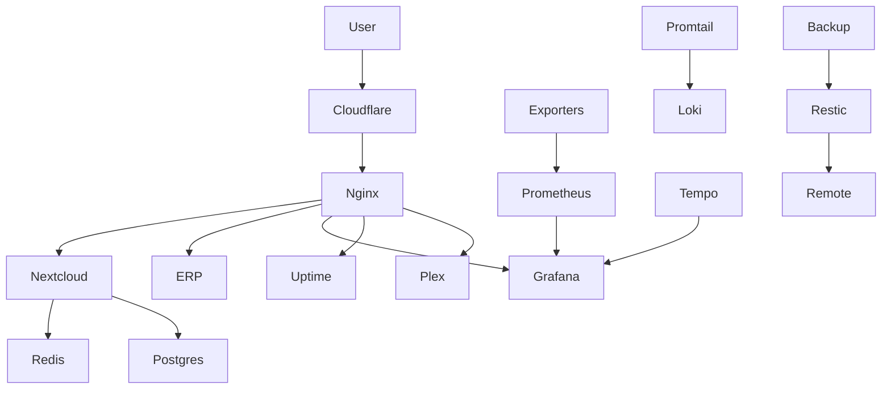
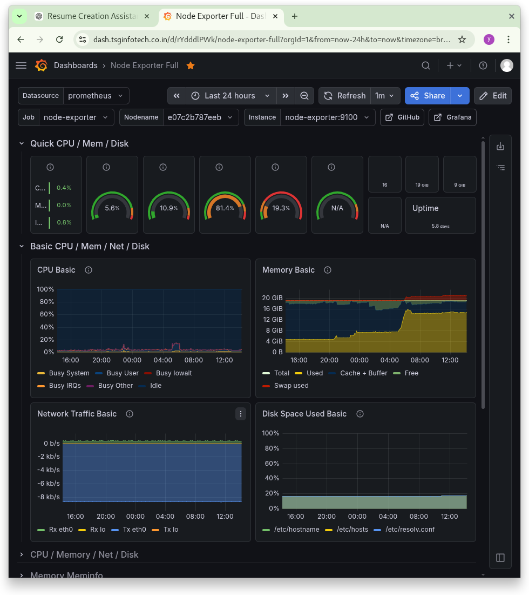
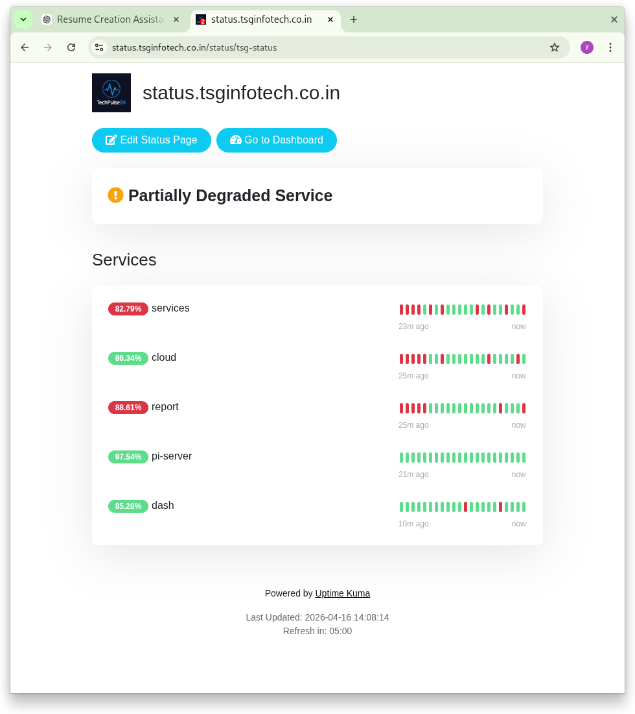
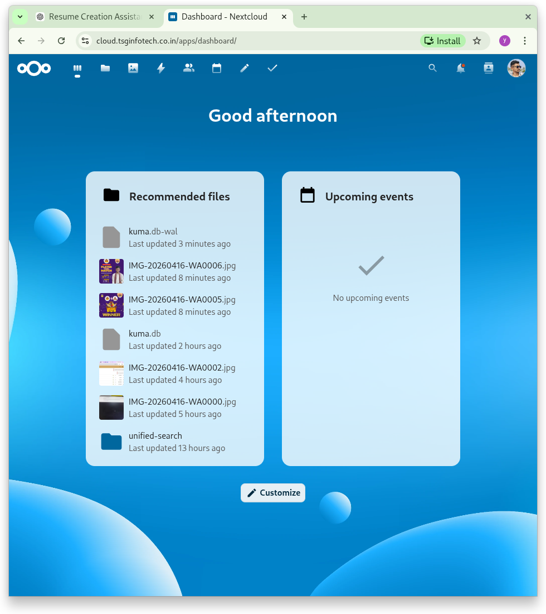
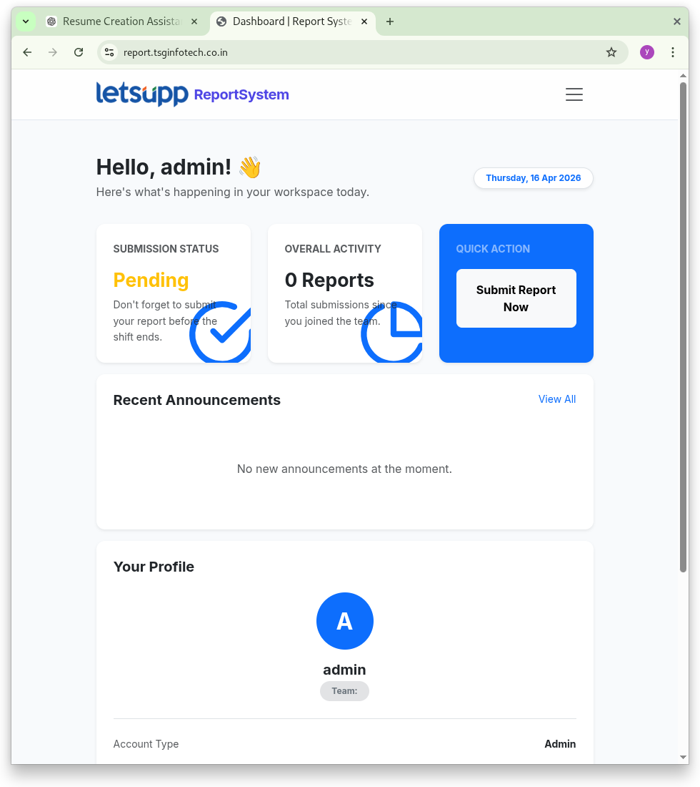
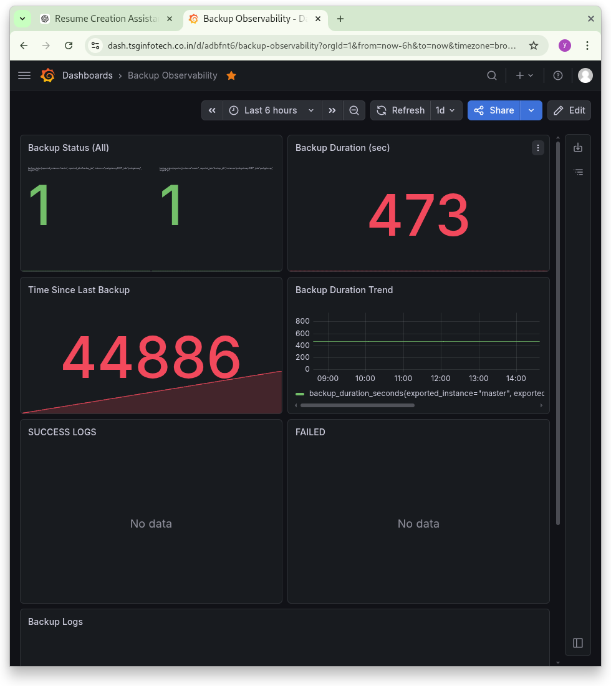

# 🧱 DevOps Homelab Infrastructure

## 📌 Overview

Production-like self-hosted infrastructure designed to simulate real-world DevOps environments.

This setup focuses on **observability, secure access, service isolation, and reliability**, running 20+ containerized services using Docker.

---

## 🏗️ Architecture

👉 Detailed diagram: [View Full Architecture](./architecture/architecture.md)

### 🔁 High-Level Flow



---

## 🧠 Architecture Decisions

### 🔐 Zero Trust Ingress

* Uses **Cloudflare Tunnel**
* No direct port exposure
* Domain-based routing for services

### 🌐 Network Segmentation

* `nextcloud_default` → app + DB + Redis
* `monitoring_default` → observability stack
* `test_default` → ERP system

👉 Ensures isolation and security between services

### ⚖️ High Availability Design

* Nextcloud runs **3 replicas**
* Load balanced via Nginx
* Stateless architecture enables scaling

---

## 🧱 Core Applications

* **Nextcloud (3-instance cluster)**
* **PostgreSQL (multiple instances)**
* **Redis (caching layer)**
* **Collabora (document editing)**
* **Custom ERP system**

---

## 📊 Observability Stack

### Metrics

* Prometheus (scraping exporters)
* Node Exporter (host metrics)
* cAdvisor (container metrics)
* Blackbox Exporter (endpoint checks)

### Visualization

* Grafana dashboards:

  * System metrics
  * Container monitoring
  * Backup observability

### Logging

* Promtail → Loki → Grafana

### Tracing

* Tempo (distributed tracing)

---

## 🔐 Networking & Access

* **Cloudflare Tunnel**

  * Zero Trust ingress
  * Domain-based routing

* **Tailscale VPN**

  * Secure private access
  * Used for backup servers and internal connectivity

---

## 💾 Backup System

Custom backup solution using **Restic + SFTP**:

* Parallel backups to:

  * Raspberry Pi (LAN)
  * Remote server (via Tailscale)
* PostgreSQL consistent dumps
* Retention policies (daily/weekly/monthly)
* Observability via Prometheus Pushgateway

👉 Full implementation:
https://github.com/yourusername/backup-system

---

## 📸 System in Action

### 📊 Monitoring (Grafana)



### 🌐 Status Page (Uptime Kuma)



### ☁️ Nextcloud



### 📈 ERP System



### 💾 Backup Observability



---

## 📦 Running Services

```bash
NAMES                   IMAGE                                  PORTS                                                                                      NETWORKS
nextcloud-nginx-lb-1    nginx:stable-alpine                    0.0.0.0:8080->80/tcp, [::]:8080->80/tcp                                                    nextcloud_default
tempo                   grafana/tempo:latest                   0.0.0.0:3200->3200/tcp, [::]:3200->3200/tcp, 0.0.0.0:4317->4317/tcp, [::]:4317->4317/tcp   monitoring_default
grafana                 grafana/grafana:latest                 0.0.0.0:3000->3000/tcp, [::]:3000->3000/tcp                                                monitoring_default
prometheus              prom/prometheus:latest                 0.0.0.0:9090->9090/tcp, [::]:9090->9090/tcp                                                monitoring_default
nextcloud-app-1         nextcloud:33                           80/tcp                                                                                     nextcloud_default,nginx-proxy-manager_default
nextcloud-app-2         nextcloud:33                           80/tcp                                                                                     nextcloud_default,nginx-proxy-manager_default
nextcloud-app-3         nextcloud:33                           80/tcp                                                                                     nextcloud_default,nginx-proxy-manager_default
plex                    plexinc/pms-docker:latest                                                                                                         host
alertmanager            prom/alertmanager:latest               0.0.0.0:9093->9093/tcp, [::]:9093->9093/tcp                                                monitoring_default
uptime-kuma             louislam/uptime-kuma                   0.0.0.0:3001->3001/tcp, [::]:3001->3001/tcp                                                monitoring_default
pushgateway             prom/pushgateway                       0.0.0.0:9091->9091/tcp, [::]:9091->9091/tcp                                                monitoring_default
promtail                grafana/promtail:latest                                                                                                           monitoring_default
blackbox                prom/blackbox-exporter                 0.0.0.0:9115->9115/tcp, [::]:9115->9115/tcp                                                monitoring_default
cadvisor                gcr.io/cadvisor/cadvisor:latest        0.0.0.0:8088->8080/tcp, [::]:8088->8080/tcp                                                monitoring_default
loki                    grafana/loki:latest                    0.0.0.0:3100->3100/tcp, [::]:3100->3100/tcp                                                monitoring_default
node-exporter           prom/node-exporter                     0.0.0.0:9100->9100/tcp, [::]:9100->9100/tcp                                                monitoring_default
tailscale               tailscale/tailscale:latest                                                                                                        host
nextcloud-db-1          postgres:16                            5432/tcp                                                                                   nextcloud_default
reporting_db            postgres:15                            5432/tcp                                                                                   test_default
nextcloud-redis-1       redis:7                                6379/tcp                                                                                   nextcloud_default
nextcloud-collabora-1   collabora/code                         0.0.0.0:9980->9980/tcp, [::]:9980->9980/tcp                                                nextcloud_default
watchtower              containrrr/watchtower                  8080/tcp                                                                                   watchtower_default
reporting_app           tsgdevelopments/reporting_erp:latest   0.0.0.0:8900->8900/tcp, [::]:8900->8900/tcp                                                nginx-proxy-manager_default,test_default
```

Includes:

* Nextcloud cluster (3 replicas + load balancer)
* PostgreSQL databases
* Redis
* Prometheus / Grafana / Loki / Tempo
* Uptime Kuma
* Plex
* ERP system
* Watchtower

---

## 🔥 Key Highlights

* Managed **20+ containerized services**
* Designed **multi-network Docker architecture**
* Built **full observability pipeline (metrics + logs + tracing)**
* Implemented **Zero Trust networking (Cloudflare + Tailscale)**
* Developed **automated backup system with monitoring**
* Enabled **service-level isolation and scalability**

---

## 🚀 Future Improvements

* Kubernetes migration (Helm-based deployment)
* CI/CD pipeline (GitHub Actions)
* Secret management (Vault / SOPS)
* Infrastructure as Code (Terraform)

---
