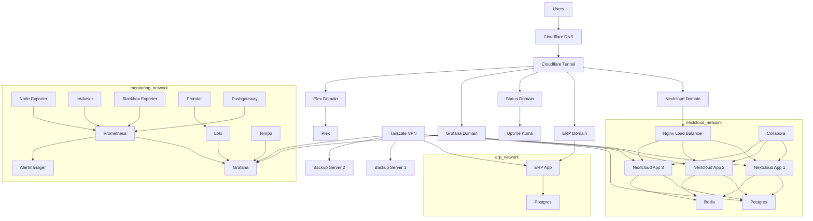

```mermaid
flowchart TD

%% INTERNET AND DNS
USER[Users] --> DNS[Cloudflare DNS]
DNS --> CF[Cloudflare Tunnel]

%% DOMAIN ROUTING
CF --> NC_DOMAIN[Nextcloud Domain]
CF --> ERP_DOMAIN[ERP Domain]
CF --> STATUS_DOMAIN[Status Domain]
CF --> GRAF_DOMAIN[Grafana Domain]
CF --> PLEX_DOMAIN[Plex Domain]

%% LOCAL SERVICES
NC_DOMAIN --> LB[Nginx Load Balancer]
ERP_DOMAIN --> ERP[ERP App]
STATUS_DOMAIN --> UP[Uptime Kuma]
GRAF_DOMAIN --> GRAF[Grafana]
PLEX_DOMAIN --> PLEX[Plex]

%% NEXTCLOUD STACK
subgraph nextcloud_network
LB --> NC1[Nextcloud App 1]
LB --> NC2[Nextcloud App 2]
LB --> NC3[Nextcloud App 3]
NC1 --> DB[Postgres]
NC2 --> DB
NC3 --> DB
NC1 --> REDIS[Redis]
NC2 --> REDIS
NC3 --> REDIS
COL[Collabora] --> NC1
COL --> NC2
COL --> NC3
end

%% MONITORING STACK
subgraph monitoring_network
PROM[Prometheus]
NODE[Node Exporter] --> PROM
CAD[cAdvisor] --> PROM
BB[Blackbox Exporter] --> PROM
PROM --> GRAF
PROM --> ALERT[Alertmanager]
PROMTAIL[Promtail] --> LOKI[Loki]
LOKI --> GRAF
TEMPO[Tempo] --> GRAF
PUSH[Pushgateway] --> PROM
end

%% ERP STACK
subgraph erp_network
ERP --> ERPDB[Postgres]
end

%% PRIVATE NETWORK
TS[Tailscale VPN]
TS --> NC1
TS --> NC2
TS --> NC3
TS --> DB
TS --> GRAF
TS --> ERP
TS --> B1[Backup Server 1]
TS --> B2[Backup Server 2]
```
